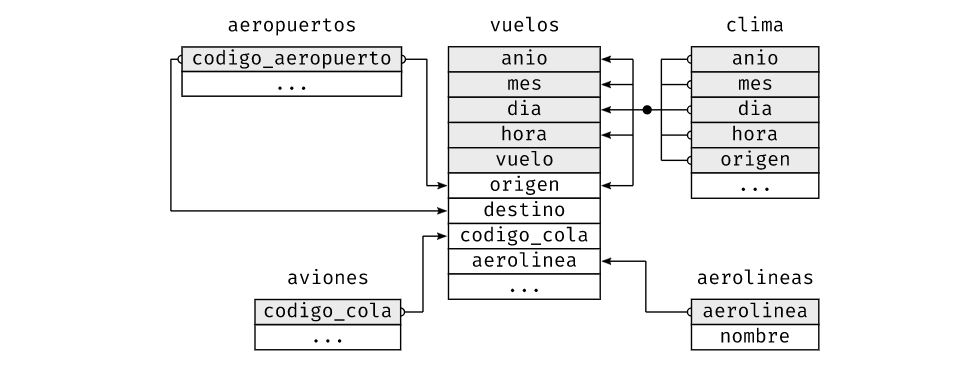

```{r setup, include=FALSE}
library(tidyverse)
library(datos)
```
Se llama datos relacionales al conjunto de múltiples tablas de datos que se utilizan para combinar, ya que sus relaciones, y no solo los conjuntos de datos individuales, son importantes.  

**Las relaciones siempre se definen sobre un par de tablas.** Todas las otras relaciones se construyen sobre esta idea simple: las relaciones entre tres o más tablas son siempre una propiedad de las relaciones entre cada par. **A veces ambos elementos de un par pueden ser la misma tabla**.  

Existen tres familias de verbos diseñadas para trabajar con datos relacionales:

* **Uniones de transformación** (del inglés **mutating joins**), que agregan nuevas variables a un data frame a partir de las observaciones coincidentes en otra tabla.

* **Uniones de filtro** (del inglés **filtering joins**), que filtran observaciones en un data frame con base en si coinciden o no con una observación de otra tabla.

* **Operaciones de conjuntos** (del inglés **set operations**), que tratan las observaciones como elementos de un conjunto.

El lugar más común para encontrar datos relacionales es en un sistema relacional de administración de bases de datos (Relational Data Base Management System en inglés), un concepto que abarca casi todas las bases de datos modernas. 

Usaremos datos sobre vuelos desde y hacia Nueva York. El paquete datos contiene cinco tibbles que utilizaremos para este propósito: aerolineas, aeropuertos, aviones y clima, que se relacionan con la tabla vuelos. 




## Claves 

Las variables usadas para conectar cada par de variables se llaman claves. Una clave es una variable (o un conjunto de variables) que identifican de manera única una observación. Existen dos tipos de claves:  
* clave **primaria** identifica únicamente una observación en su propia tabla. Por ejemplo, aviones$codigo_cola.  
* clave foránea únicamente identifica una observación en otra tabla. Por ejemplo, vuelos$codigo_cola.  

Una variable puede ser clave primaria y clave foránea a la vez. Por ejemplo, origen es parte de la clave primaria clima y también una clave foránea de aeropuertos. 

```{r verificar_primary_key}
aviones %>% 
  count(codigo_cola) %>% 
  filter(n > 1)  

# es lo mismo que hacer  aviones %>% group_by(codigo_cola) %>% count() %>% filter(n > 1) pero de esta forma el tibble queda agrupado
```

A veces una tabla puede no tener una clave primaria explícita. Por ejemplo en la tabla vuelos se puede pensar el código de cola. Pero no es única, ni tampoco la fecha-vuelo. **Si una tabla no tiene una clave primaria, a veces es útil incluir una con mutate() y row_number() (número de fila)**.  
Eso simplifica hacer coincidir observaciones una vez que haz hecho algunos filtros y quieres volver a verificar con los datos originales. Esto se llama **clave subrogada**.

Una clave primaria y su correspondiente clave foránea en otra tabla forman una **relación**.  
Las relaciones son típicamente uno-a-muchos. También uno-a-uno. en general relaciones muchos-a-muchos se pueden modelar como relaciones de la forma muchos-a-uno y uno-a-muchos.  

## Uniones de transformación
unión de transformación o **mutating join** permite combinar variables a partir de dos tablas. Primero busca coincidencias de observaciones de acuerdo a sus claves y luego copia las variables de una tabla en la otra. Tal como mutate(), las funciones de unión agregan variables hacia la derecha.

Puedes combinar los datos de aerolinas y vuelos2 con left_join() (union_izquierda):

```{r vuelos2}
vuelos2 <- vuelos %>%
  select(anio:dia, hora, origen, destino, codigo_cola, aerolinea) %>% 
  head(10)

vuelos2 %>%
  select(-origen, -destino) %>% 
  left_join(aerolineas, by = "aerolinea") %>% 
  head(10)

#asi se hace en R base
# vuelos2 %>%
#   select(-origen, -destino) %>%
#   mutate(nombre = aerolineas$nombre[match(aerolinea, aerolineas$aerolinea)])
```
El resultado de unir aerolineas y vuelos2 es la inclusión de una variable adicional: nombre. 
Cuando trabajas con datos reales, las claves no siempre identifican a las observaciones de forma única.  

### Entendiendo las uniones

Vamos a definir 2 tibbles:
```{r}
x <- tribble(
  ~key, ~val_x,
  1, "x1",
  2, "x2",
  3, "x3"
)
y <- tribble(
  ~key, ~val_y,
  1, "y1",
  2, "y2",
  4, "y3"
)
```


### Uniones interiores - Inner join: 
La forma más simple de unión es inner join: une pares de observaciones siempre que sus claves sean iguales. Esto corresponde a una unión de igualdad (o equijoin), debido a que las claves se unen usando el operador de igualdad, que es el más usado.  
El output de una unión interior es un nuevo data frame que contiene la clave, los valores de x y los valores de y. Usamos by (según) para indicar a dplyr qué variable es la clave:

```{r inner_join}
x %>%
  inner_join(y, by = "key")
```
**La propiedad más importante de una unión interior es que las filas no coincidentes no se incluyen en el resultado.**  

### Uniones exteriores:

Una unión interior mantiene las observaciones que aparecen en ambas tablas. Una unión exterior mantiene las observaciones que aparecen en al menos una de las tablas. Existen tres tipos de uniones exteriores:

* Una unión izquierda (left join) mantiene todas las observaciones en x.
* Una unión derecha (right join) mantiene todas las observaciones en y.
* Una unión completa (full join) mantiene todas las observaciones en x e y.

La unión que más frecuentemente se usa es la unión izquierda: úsala cuando necesites buscar datos adicionales en otra tabla, dado que preserva las observaciones originales incluso cuando no hay coincidencias. La unión izquierda debiera ser tu unión por defecto, a menos que tengas un motivo importante para preferir una de las otras.

### Claves duplicadas

Existen dos posibilidades:
1. Una tabla tiene claves duplicadas. Esto es útil cuando quieres agregar información adicional dado que típicamente existe una relación uno a muchos.

```{r clave_duplicada left_join}
x <- tribble(
 ~key, ~val_x,
 1, "x1",
 2, "x2",
 2, "x3",
 1, "x4"
)
y <- tribble(
 ~key, ~val_y,
 1, "y1",
 2, "y2"
)
left_join(x, y, by = "key")
```

2. Ambas tablas tienen claves duplicadas. Esto es usualmente un error debido a que en ninguna de las tablas las claves identifican de manera única una observación. Cuando unes claves duplicadas, se obtienen todas las posibles combinaciones, es decir, el producto cartesiano:

```{r ambas tablas con claves duplicadas left_join}
x <- tribble(
 ~key, ~val_x,
 1, "x1",
 2, "x2",
 2, "x3",
 3, "x4"
  )
  y <- tribble(
 ~key, ~val_y,
 1, "y1",
 2, "y2",
 2, "y3",
 3, "y4"
  )
  left_join(x, y, by = "key")
```

### Definiendo las columnas clave:

El parámetro que usamos para indicar por cuales columnas estamos conectando es "by". Existe más de una manera de usar by para conectar las tablas:

* Por defecto, ´by = NULL´, usa todas las variables que aparecen en ambas tablas, lo que se conoce como unión **natural**. Por ejemplo, las tablas vuelos y clima coinciden en sus variables comunes: ´anio, mes, dia, hora y origen´. 
```{r left_join_null vuelos_clima}
vuelos2 %>%
 left_join(clima)
```

* Un vector de caracteres, by = "x". Esto es similar a una unión natural, pero usa algunas de las variables comunes.Por ejemplo, vuelos y aviones tienen la variable anio, pero esta significa cosas distintas en cada tabla por lo que queremos unir por codigo_cola.

```{r left_join_by_codigocola}
vuelos2 %>%
 left_join(aviones, by = "codigo_cola")
```

Nota que la variable anio (que aparece en los dos data frames de entrada, pero que no es igual en ambos casos) se desambigua con un sufijo en el output.


* Un vector de caracteres con nombres: by = c("a" = "b"). Esto va a unir la variable a en la tabla x con la variabla b en la tabla y. Las variables de x se usarán en el output.

```{r left_join_by distintos_nombres_en_tablas}
vuelos2 %>%
 left_join(aeropuertos, c("origen" = "codigo_aeropuerto")) %>% 
  head(10)
vuelos2 %>%
 left_join(aeropuertos, c("destino" = "codigo_aeropuerto")) %>% 
  head(10)
```


## Uniones de filtro: 

Las uniones de filtro unen observaciones de la misma forma que las uniones de transformación pero afectan a las observaciones, no a las variables. Existen dos tipos:  

* semi_join(x, y) mantiene todas las observaciones en x con coincidencias en y.  
* anti_join(x, y) descarta todas las observaciones en x con coincidencias en y.

Las semi uniones son útiles para unir tablas resumen previamente filtradas con las filas originales. Por ejemplo, imagina que encontraste los diez destinos más populares:

```{r semi_join}
destinos_populares <- vuelos %>%
  count(destino, sort = TRUE) %>%
  head(10)

vuelos %>%    #no recomendado: es difícil extender este enfoque a varias variables y es costoso
  filter(destino %in% destinos_populares$destino)

vuelos %>%    # así es menos costoso y es claro
  semi_join(destinos_populares)
```

**Las uniones de filtro nunca duplican filas como lo hacen las uniones de transformación**  

Las anti uniones son útiles para encontrar desajustes. Por ejemplo, al conectar aviones y vuelos, podría interesarte saber que existen muchos vuelos que no tienen coincidencias en aviones:  
```{r anti-join}
vuelos %>%   # buscamos los que no están en el otro dataset
  anti_join(aviones, by = "codigo_cola") %>%
  count(codigo_cola, sort = TRUE)
```

## Problemas con las uniones:

Hay algunas consideraciones y pasos a tener en cuenta para que las uniones funcionen adecuadamente sobre tus propios datos.  

1. Comienza identificando las variables que forman las claves primarias en cada tabla.  
2. Verifica que ninguna de las variables en la clave primaria esté perdida (NA). ¡Si hay un **valor faltante** no podrá identificar una observación!
3. Verifica que las claves foráneas coincidan con las claves primarias en otra tabla. La mejor forma de hacerlo es mediante un anti_join(). Es común que las claves no coincidan debido a errores en la entrada de datos. Arreglar este problema requiere mucho trabajo.  

Si tienes claves perdidas, debes tener cuidado en el uso de unión interior versus unión exterior y considerar cuidadosamente si quieres descartar las filas que no tengan coincidencias.  

**Ten en cuenta que verificar el número de filas antes y después de unir no es suficiente para asegurar que la unión funcionó de forma exitosa.** Si tienes una unión interior con claves duplicadas en ambas tablas, puedes tener la mala suerte de que el número de filas descartadas sea igual al número de filas duplicadas.  

## Operaciones de conjunto:

El tipo final de verbo para dos tablas son las operaciones de conjunto. Si bien lo usamos de manera poco frecuente, en ocasiones es útil cuando quieres dividir un filtro complejo en partes maś simples. Todas estas operaciones funcionan con una fila completa, comparando los valores de cada variable. Esto espera que los input x e y tengan las mismas variables y trata las observaciones como conjuntos:  

* intersect(x, y): devuelve las observaciones comunes en x e y.  
* union(x, y): devuelve valores únicos comunes en x e y.
* setdiff(x, y): devuelve valores de x que no están en y.


También existe: 
 is.element(elemento, conjunto) que determina si es elemento en el otro (devuelve TRUE o FALSE)
 setequal(x, y) determina si son iguales x e y (devuelve TRUE o FALSE)
```{r set_operations intersect union setdiff}
df1 <- tribble(
  ~x, ~y,
  1, 1,
  2, 1
)
df2 <- tribble(
  ~x, ~y,
  1, 1,
  1, 2
)

# 4 operaciones
intersect(df1, df2)
union(df1, df2) # Nota que obtenemos 3 filas, no 4
setdiff(df1, df2)
setdiff(df2, df1)
setequal(df2, df1)
setequal(df1, df1)
```

```{r ejemplos}
intersect(1:5, 4:8)
union(1:5, 4:8)
setdiff(1:5, 4:8)
setdiff(4:8, 1:5)
```


[Para ver en la practica como funciona](https://www.garrickadenbuie.com/project/tidyexplain/#inner-join)

